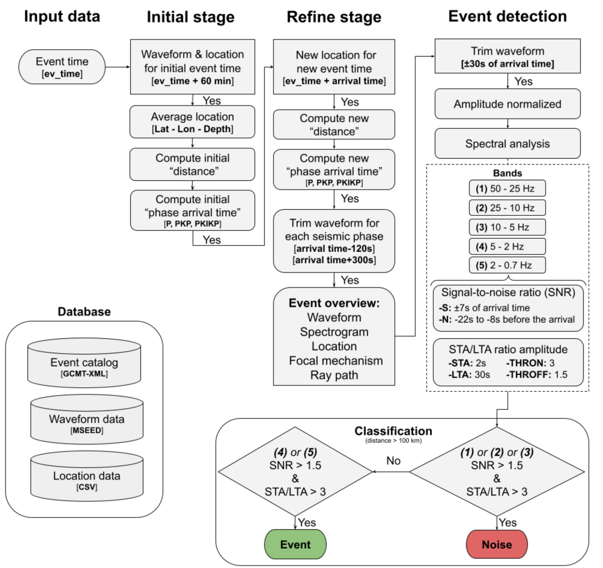

# 🌊 Ocean drones enabling long-term earthquake monitoring in target zones 🌊

This repository contains reproducible material for the study **"Ocean drones enabling long-term earthquake monitoring in target zones"** by *Diogo L. de Oliveira Coelho¹, Marcelo B. de Bianchi², Ítalo C.B.S. Maurício¹, Carlos A. M. Chaves², Sergio L. Fontes¹, Ricardo G. Borges³* submitted to *Scientific Reports*. 

1. Geophysics Department, Observatório Nacional, Rio de Janeiro, Brazil
2. Geophysics Department, Universidade de São Paulo, São Paulo, Brazil
3. The Leopoldo Américo Miguez de Mello Research, Development and Innovation Center, Rio de Janeiro, Brazil, 

## 📦 Required Libraries 📦

The following libraries are used in this project:

### Core Seismology & Signal Processing
- [Obspy](https://github.com/obspy/obspy): Fundamental package for seismological data processing and analysis
- [Scipy](https://scipy.org/): Scientific computing tools (signal processing module used)
- [scikit-learn](https://scikit-learn.org/): Machine learning tools (preprocessing module used)

### Data Handling
- [NumPy](https://numpy.org/): Fundamental package for numerical computing
- [Pandas](https://pandas.pydata.org/): Data analysis and manipulation
- [subprocess](https://docs.python.org/3/library/subprocess.html): For running external commands (CAKE)
- [os](https://docs.python.org/3/library/os.html): Operating system interfaces
- [glob](https://docs.python.org/3/library/glob.html): Unix-style pathname pattern expansion
- [datetime](https://docs.python.org/3/library/datetime.html): Date/time handling

### Parallel Processing
- [multiprocessing](https://docs.python.org/3/library/multiprocessing.html): Parallel processing capabilities

### Progress & Utility
- [tqdm](https://github.com/tqdm/tqdm): Progress bars for loops

### Visualization & Mapping
- [Matplotlib](https://matplotlib.org/): Comprehensive plotting library
- [Cartopy](https://scitools.org.uk/cartopy/): Geographic mapping and projections
- [Shapely](https://shapely.readthedocs.io/): Geometric objects and operations


## 🖱️ Installation 🖱️

To use the provided notebooks, install the required dependencies:

```bash
# Core packages
pip install obspy scipy scikit-learn numpy pandas tqdm

# Visualization
pip install matplotlib cartopy shapely

# Optional extras
pip install pyproj multiprocess
```

## 🏗️ Repository structure 🏗️

```plaintext
📦 root
├── 📄 README.md                                                 # Project overview and instructions  
├── 📑 Event_classification.ipynb                                # Jupyter notebook for event classification  
├── 📂 Sample/                                                   # Folder with reproducible material  
│   ├── 📂 CSV/                                                  # Metadata and input data  
│   │   └── 📄 metadados_glider.csv                              # Glider metadata  
│   ├── 📂 EARTH_MODEL_AREA/                                     # Velocity model for travel-time calculations  
│   │   └── 📄 model_ak135_SOFAR.nd                              # Modified ak135 model for SOFAR channel  
│   ├── 📂 EVENTS/                                               # Event origin and focal information  
│   │   └── 📄 CMTSOLUTIONS.xml                                  # CMT solutions for teleseismic events  
│   ├── 📂 MSSED_DATA/                                           # Raw waveform data from gliders  
│   │   └── 📂 2017/  
│   │       └── 📂 105/  
│   │           └── 📂 2017.105.08.19.48.300/  
│   │               └── 📄 GL.G170B.2017.105.08.19.48.300.H      # Waveform with Event ID: 201704150819A  
│   ├── 📂 OUTPUT/                                               # Results and figures  
│   │   ├── 📂 EVENTS_GLIDERS/                                   # Classified events related to gliders  
│   │   └── 📂 FIGURAS/                                          # Generated figures  
│   │       ├── 📂 EVENT_MSEED_TELESEISMIC_DETECTION/            # All detected teleseismic events  
│   │       └── 📂 EVENT_MSEED_TELESEISMIC_DETECTION_SELECTED/   # Selected subset of events  
```


## 📑 Notebooks 📑

Automatically detects and classifies the M6.0 earthquake at the Chile-Argentina border (Event ID: 201704150819A) by processing seismic data from the sample folder.

The following notebook is provided:

- 📔 ``Event_classification.ipynb``

## ⌨️ Usage ⌨️

1. Clone this repository:
   ```bash
   git clone <repository_url>
   cd Codes_Ocean_drones_monitoring_earthquakes_in_ultradeep_waters
   ```
2. Open the Jupyter Notebook environment:
   ```bash
   jupyter-lab
   ```
3. Run the following notebooks to reproduce the results:
   - `Event_classification.ipynb`

## 🧮 Algorithm 🧮

#### **Automated event detection flowchart**

Algorithm to detect global earthquakes (epicentral distance > 100 km) automatically, and the database utilized (bottom left).




## 🔖 Disclaimer 🔖  

All experiments were conducted on two different setups running **Debian GNU/Linux 12 (Bookworm)**:  

- 💻 **AMD Ryzen 7 5700U** with **10 GB RAM**  
- 💻 **Intel® Core™ Ultra 9** with **64 GB RAM**  

📣 **Multiprocessing is implemented.**  

---
For further details, refer to the paper associated with this repository.